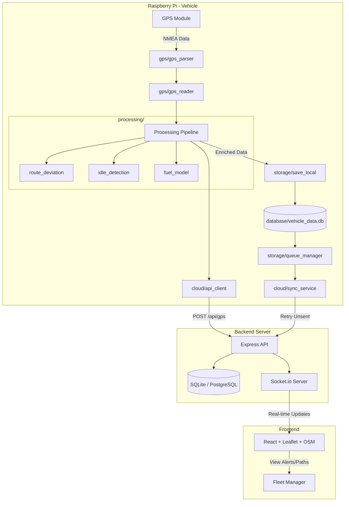
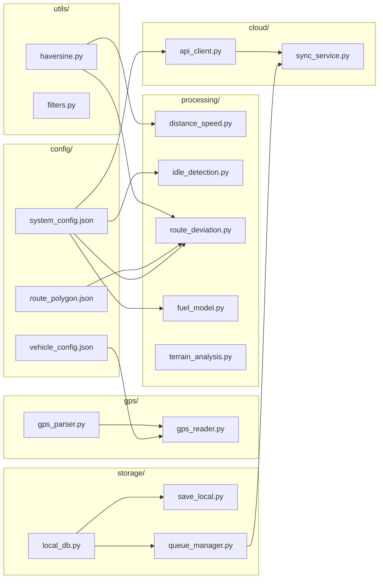
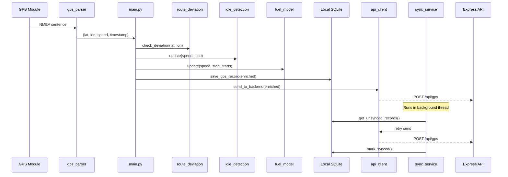
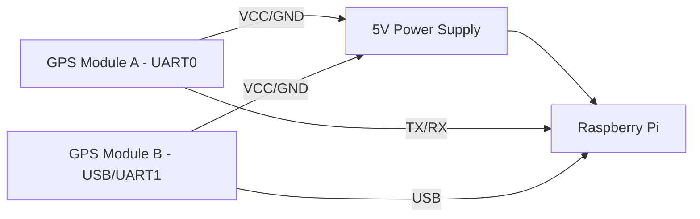

# System Architecture & Hardware Diagrams

## System Architecture

## Edge Module Architecture

## Data Flow

## Hardware Wiring Diagram

### Components Table

| Component | Purpose | Pins/Interface |
|-----------|---------|----------------|
| Raspberry Pi 4 | Edge Computing | - |
| NEO-6M GPS (x2) | Location Tracking | UART (GPIO 14, 15) / USB |
| Breadboard/Wires | Connections | - |
| Power Bank/Adapter| Power | 5V 3A |
