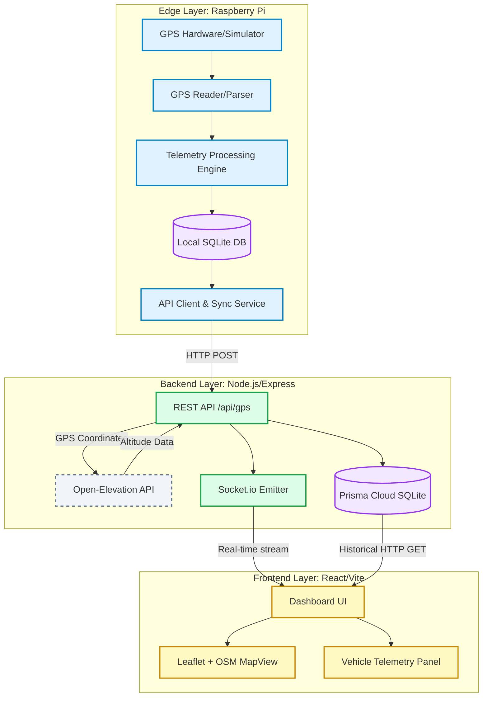

# System Architecture: Fleet Tracker

This document outlines the end-to-end data flow and system architecture for the Fleet Tracker project. It covers where the data originates, how it undergoes processing on the edge, how it is ingested and stored in the backend, and exactly how it is rendered on the client side.

## High-Level Architecture Diagram

---

## 1. Where the Data is Coming From (Data Ingestion)

Data originates purely at the **Edge Layer** (typically a Raspberry Pi installed in the haul truck). 

* **Hardware Mode:** A physical GPS module is connected via serial port (e.g., `/dev/ttyUSB0`). The `gps_reader.py` script reads raw continuous NMEA sentences and parses them into usable latitude and longitude structures.
* **Simulation Mode:** If physical hardware is missing, `simulator.py` generates synthetic GPS coordinates. It follows a configured timeline (dictated by `vehicle_config.json`) simulating a truck traversing a haul road (including realistic stops, normal movement, and erratic deviations).

## 2. How Data is Processed at the Edge

Before the data ever leaves the truck, it gets processed comprehensively by local Python scripts located in `edge/processing/`. The system enriches the raw GPS points into actionable telemetry:

1. **Distance & Speed Calculation:** Generates delta metrics between the current ping and the previous ping using the Haversine formula (`distance_speed.py`), giving precise speed and overall accumulated distance travelled.
2. **Idle Detection:** The `idle_detection.py` script flags an `IDLE` alert if the speed drops to near zero and stays there for over 5 minutes.
3. **Route Deviation Checks:** The `route_deviation.py` script acts as a spatial geofence. It compares the current coordinates against predefined haul road polygons (`route_polygon.json`). If the truck strays more than 50 meters outside of this polygon, it generates a `ROUTE_DEVIATION` alert.
4. **Fuel Consumption Modeling:** The `fuel_model.py` module extrapolates synthetic fuel consumption metrics based on current speeds and sudden vehicle acceleration anomalies (generating `FUEL_ANOMALY` alerts).

**Buffering:**
Processed data is instantly dumped into a local Edge SQLite database (`database/vehicle_data.db`). This acts as a reliable buffer. If the truck drives into a dead zone without internet, the `queue_manager.py` holds the data and the `sync_service.py` safely uploads the payload chronologically once connectivity returns.

## 3. How Data is Stored in the Backend

The Edge layer uses `api_client.py` to continuously send HTTP POST requests with the processed telemetry to the Cloud Backend (`/api/gps`).

1. **Topographical Enrichment:** As data hits the Express.js `routes/api.js` endpoint, the Node server intercepts the lat/lon. It immediately makes highly concurrent requests out to the open-source **Open-Elevation API** to fetch exact altitude and topographic elevation.
2. **Permanent Storage via Prisma ORM:** 
   The data payload is then securely written into the central Cloud Database (a cloud SQLite instance for now, architected to scale to PostgreSQL). 
   The Prisma schema (`schema.prisma`) maps out specific tables for:
   * **Vehicles:** Static data.
   * **GPS Records:** Location history appended with elevation and total distance/fuel logic.
   * **Alerts:** Table storing Idle, Deviation, and Fuel Anomalies to draw attention to dispatcher dashboards.

## 4. How it is Rendered in the Frontend

Simultaneously as data is saved to the SQLite database, the backend Node.js `server.js` pushes the freshly ingested objects down a **Socket.io WebSocket** channel directly to any active web client.

1. **React State Hooks:** The frontend (`frontend/src/hooks/useFleetData.js`) utilizes React hooks to subscribe to these WebSocket events, keeping an in-memory, zero-refresh reactive state of all truck locations and their metrics. 
2. **Leaflet Map Rendering:** The `MapView.jsx` component uses **react-leaflet**. 
   * It plots OpenStreetMap base tiles (or Topo, Satellite, Dark mode tiles based on user toggle).
   * It dynamically moves truck Map Markers to their new lat/lon positions instantly upon socket ping.
   * Based on the incoming state, it draws the dynamic line trails of where the truck has been (route history).
3. **Alerts & Visual Feedback:** Whenever a `ROUTE_DEVIATION` status is received on the socket, the truck's marker will instantly change visual states (color changing or popups triggering) to show exact deviation distances in real-time.
4. **Telemetry Dashboard:** The `VehiclePanel.jsx` component reacts to display updated cumulative metrics prominently on the screen (e.g. Total Distance Travelled, Accumulative Fuel Consumed Liters).
